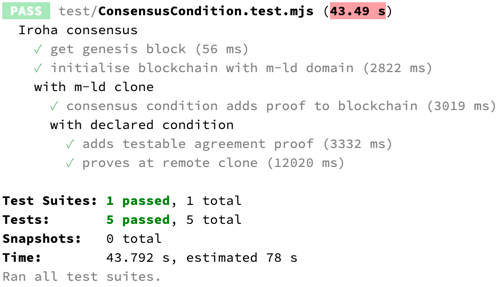

# m-ld-iroha
_[Experimental] **m-ld** extensions using Iroha_

[**m-ld**](https://m-ld.org/) is a decentralised live information sharing component with a JSON-based API. Apps using **m-ld** have the power to share live information, without any need to store or coordinate the data centrally in a database, or otherwise cope with the hard problem of keeping distributed data up to date. A bit like Google docs, but for any structured data specific to the app: designs, bookings, observations, plans or anything else; and also, without the need to entrust the data to a third party.

[**Hyperledger Iroha**](https://www.hyperledger.org/use/iroha) "is a simple blockchain platform you can use to make trusted, secure, and fast applications by bringing the power of permission-based blockchain with Crash fault-tolerant consensus. It’s free, open-source, and works on Linux and Mac OS, with a variety of mobile and desktop libraries."

This repo is for a prototype integration between **m-ld** and Iroha.

At present, it contains an example integration that uses Iroha byzantine fault-tolerant consensus to verify changes to "significant" data (statutes) in **m-ld**.

## why

The base concurrency model of **m-ld** is _live-by-default_ using a Conflict-free Replicated Data Type (CRDT). This means that concurrent transactions at remote nodes* are committed independently, giving maximum availability and responsiveness. In recognition that some transactions may conflict with each other in ways that can fundamentally disallow the preservation of both users' intentions – for example many kinds of change to security attributes – we are exploring how to extend the base model to should allow for mandatory _coordination_ between nodes, for selected changes. In order to remain flexible (and to limit the scope of **m-ld**), the means by which coordination occurs is pluggable via extension points.

> Read more about the motivation behind these explorations and the conceptual model for the solution in the [**m-ld** security project](https://github.com/m-ld/m-ld-security-spec/blob/main/design/suac.md).

In contrast to **m-ld**, blockchain-based systems like Iroha coerce all transactions into a total ordering, decided by consensus – a form of coordination. A transaction may only be applied once the previous transaction in the ordering has committed. This means that changes submitted while the network is partitioned are provisional, and may later fail if their preconditions are not met once the ordering has been decided.

The proposed conceptual model for coordination in **m-ld** allows for the declaration of _statutes_ – selections of information which require an _agreement_ to change. Examples of statutes include security attributes, schema information, and status fields that change the gross behaviour of the domain, such as the ["agreed" status of an invoice](https://github.com/m-ld/m-ld-security-spec/blob/main/threats/e-invoicing.md#data). The way that an agreement is coordinated is via _conditions_ which must be met prior to the agreement.

The first integration between **m-ld** and Iroha is therefore a kind of agreement condition which requires data to be entered into Iroha (thus adding a block to its blockchain). The effect of this condition is to only allow a statute to be changed if its originating node has visibility of an Iroha node, and the Iroha node can establish  consensus with its peers.

* We use the term "node" to mean any compute location – whether a user device or server. **m-ld** "clones" are usually deployed on client devices (see the [**m-ld** documentation](https://m-ld.org/doc/)); Iroha nodes are typically servers.

## how

The [ConsensusCondition](./lib/ConsensusCondition.js) class encapsulates the Iroha consensus agreement condition. It conforms to the **m-ld** AgreementProver interface, which is a (sub-)extension point of the [Statutory](https://github.com/m-ld/m-ld-js/blob/edge/src/constraints/Statutory.ts) extension that enforces the concept of statutes.

Both the Statutory extension and the ConsensusCondition extension are loaded automatically by **m-ld** in response to their declaration in the data. The latter declaration is made easier for the app by use of the `ConsensusCondition.declare` method.

The Statutory extension identifies changes to statutes, and in response it challenges the configured AgreementProver to provide a proof, via the `prove` method. In the case of the Iroha ConsensusCondition, the proof comprises the key to a key-value pair entered into the Iroha blockchain using [SetAccountDetail](https://iroha.readthedocs.io/en/main/develop/api/commands.html#set-account-detail). The value of the key-value pair is a serialisation of the _final state_ of the affected statutes. This allows the recipient of an agreement proof (any other clone) not only to confirm that the block has been added – by loading the key-value pair – but also to check that the agreement has not been substituted, by confirming the final state of the affected statutes locally, in the `test` method.

By default, Iroha uses a custom cryptographic algorithm, [Ed25519 with SHA-3](https://iroha.readthedocs.io/en/main/develop/keys.html), for identifying users and signing data. When using the Iroha integration, the app must provide a suitable private key for the current user, as well as a gRPC connection to Iroha. This is typed as a custom sub-interface of MeldApp, MeldIrohaApp.

## status

Since the basis for agreements and statutes was established in the [previous project milestone](https://github.com/m-ld/m-ld-js/pull/94), the work for this research milestone primarily comprised:
1. Experimenting with Iroha (in a docker container), and composing the pattern used for agreement proof.
2. This repo also demonstrates one way to structure an extension to **m-ld** (e.g. the use of plain Javascript instead of Typescript).
3. Making a number of [necessary features and fixes](https://github.com/m-ld/m-ld-js/pull/98) in **m-ld**, including to support the Statutory sub-extension point and refactoring of extensions in general.
4. Composing the [integration tests](#tests) script. This juggles Jest in an ECMAScript module, Iroha in docker using docker-compose, and orchestration of a node child process (see last test).

### next steps

As an append-only ledger with strong cryptographic binding of users to records, Hyperledger Iroha provides a natural candidate technology for the next stage of security prototyping, [**traceability**](https://github.com/m-ld/m-ld-security-spec/issues/3), in which it will be put to work as an audit logging system. Challenges will include how to ensure that the audit trail is both complete and not overwhelmed by high-frequency updates arising in **m-ld** – e.g. per-keypress.

### other future possibilities

- **User consensus**. The form of coordination being utilised by the ConsensusCondition is algorithmic consensus among Iroha nodes. A more intuitive form of consensus would be among users – for example, that a certain quorum of users must agree to a particular change. A possible way to achieve this with Iroha would be to require [multiple signatories on such a transaction](https://iroha.readthedocs.io/en/main/concepts_architecture/glossary.html#multisignature-transactions).
- **Permissions management**. Iroha could be used as a permissions store for **m-ld**, as an alternative to storing permissions in the **m-ld** domain itself (as described in Symmetric Unilateral Access Control and prototyped in [WritePermitted](https://github.com/m-ld/m-ld-js/blob/edge/src/constraints/WritePermitted.ts)).
- **Reconciled cryptography**. The prototype implementation of **m-ld** [transport security](https://github.com/m-ld/m-ld-js/blob/edge/src/security/MeldAclTransportSecurity.ts) uses `RSASSA-PKCS1-v1_5` signatures. This means that combining both that extension and the Iroha consensus condition would require the user to have two private keys – with commensurate key management overhead.
- **Trust model**. Iroha's byzantine fault-tolerant consensus may be able to provide a trust model for **m-ld** that is protective against malware (see the [security project analysis](https://github.com/m-ld/m-ld-security-spec/blob/main/design/suac.md#trust)). This concept requires more research.

## tests

The [ConsensusCondition test](./test/ConsensusCondition.test.mjs) is an integration test which runs Iroha in a docker container and exercises the automatic use of **m-ld** agreements, and their proof using Iroha.

## biblio
- **m-ld** security project homepage: https://github.com/m-ld/m-ld-security-spec
- Hyperledger Iroha homepage: https://www.hyperledger.org/use/iroha
- Iroha documentation: https://iroha.readthedocs.io/en/main/index.html
- Iroha Javascript client library: https://github.com/hyperledger/iroha-javascript
- YAC: BFT Consensus Algorithm for Blockchain (used by Iroha): https://arxiv.org/pdf/1809.00554
